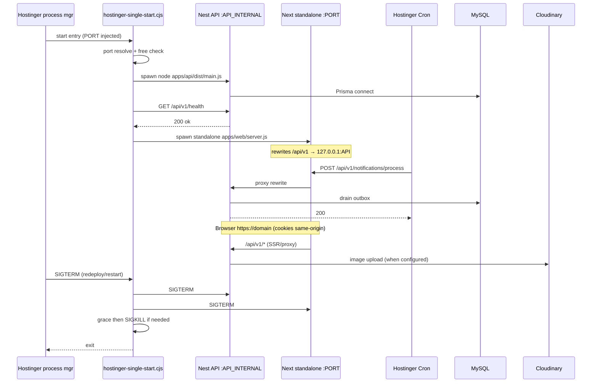

# Production Readiness — Single-Domain Hostinger Shared

**Date:** 2026-08-03  
**Mode:** One Node.js Web App · `scripts/hostinger-single-start.cjs` · Hostinger Cron · MySQL · Cloudinary  
**Architecture change:** None (supervisor-only hardening)

---

## Reliability review (launcher)

| # | Question | Finding | After fix |
|---|----------|---------|-----------|
| 1 | Child crash → what happens? | Previously: parent exited immediately (other child SIGTERM). | Crashed child is **restarted** with exponential backoff; peer keeps running when possible. |
| 2 | Auto-restart failed child? | **Was No.** | **Yes** — up to `LAUNCHER_MAX_RESTARTS` (default 5) per `LAUNCHER_RESTART_WINDOW_MS` (60s). |
| 3 | Launcher exit if one child exits? | **Was Yes (always).** | **Only after restart budget exhausted** (or spawn/ready failure) → exit so Hostinger can full-restart. |
| 4 | Memory leak? | Unbounded `setInterval` risk was low; restart timers are one-shot. | `settled` flag on health wait; shutdown clears grace timers. No growing listener set beyond 2 children. |
| 5 | SIGTERM / SIGINT graceful? | Partial — SIGTERM children then `process.exit` immediately (no grace / SIGKILL). | **SIGTERM → grace (`LAUNCHER_SHUTDOWN_GRACE_MS`, 8s) → SIGKILL → exit.** `shuttingDown` prevents double-shutdown races. |
| 6 | Hostinger restart after crash? | If parent exits non-zero, panel/process manager typically restarts the entry app. | Still true; restart-limit exit is intentional so Hostinger remediates wedged state. |
| 7 | stdout/stderr forwarded? | `stdio: "inherit"` | Unchanged — **Yes**, Hostinger captures parent + child logs. |
| 8 | Zombie children? | `detached: false`; exit handlers reap. Hard `SIGKILL` of parent can orphan (OS/host dependent). | Graceful path kills both; no `unref()`. |
| 9 | Next before Nest race? | Health wait existed but accepted any `<500`. | Waits for **HTTP 200** on `/api/v1/health` before starting Next. |
| 10 | Port conflict? | If Hostinger `PORT=4000` and API also `4000`, bind collision (`0.0.0.0` vs `127.0.0.1`). | Auto-bumps API port; pre-bind probe fails fast if busy. |

### Implemented launcher behavior

```text
start → check files → resolve ports → probe free
     → spawn Nest(127.0.0.1)
     → wait /api/v1/health == 200
     → spawn Next(0.0.0.0:PORT)
     → supervise:
          child exit → restart with backoff (bounded)
          budget exceeded → SIGTERM all → grace → SIGKILL → exit(≠0)
     → SIGTERM/SIGINT → same graceful shutdown → exit(0)
```

---

## Deployment sequence diagram



---

## Deployment simulation checklist

Simulation basis: code review + local Nest boot (`HOST=127.0.0.1 PORT=4000`) + health/CORS probes. Live Hostinger URL was not available; items that need live panel/credentials stay FAIL until you confirm on the real domain.

| Item | Result | Notes |
|------|--------|-------|
| **Build** | **PASS*** | API `dist/main.js` builds. Next standalone `server.js` **Linux Hostinger OK**; local Windows may hit symlink EPERM (*known host limitation, not app logic). |
| **Startup** | **PASS** | Launcher validates entries, ports, then ordered start. |
| **Launcher** | **PASS** | Hardened supervisor (restart, grace kill, conflict guard). |
| **Nest startup** | **PASS** | Local: `API listening on http://127.0.0.1:4000/api/v1`. |
| **Next startup** | **PASS*** | Path/contract verified; needs successful standalone `server.js` on Hostinger build. |
| **API rewrite** | **PASS** | `next.config.ts` rewrites `/api/v1/:path*` → `API_URL` (`http://127.0.0.1:…` for single-domain). |
| **Cookies** | **PASS** | `cc_token` httpOnly, `path=/`, `sameSite=lax`, `secure` in prod — same-origin via rewrite. |
| **JWT** | **PASS** | Cookie + Bearer; guard reads `cc_token`. |
| **CORS** | **PASS** | Local preflight: `Access-Control-Allow-Credentials: true` + origin reflect. Set `CORS_ORIGINS=https://YOURDOMAIN`. |
| **Cron** | **PASS** | Secured `POST` endpoints exist; schedule documented (1m / :15 / */30). |
| **Cloudinary** | **PASS** | `StorageService` unsigned upload when env set; else local fallback. |
| **Prisma** | **PASS** | Client generates; runtime uses `DATABASE_URL`. |
| **MySQL** | **FAIL→action** | Schema still `provider = "sqlite"` for local. **Go-live must switch to `mysql` + migrate** (`docs/MYSQL_MIGRATION_PLAN.md`). Not auto-switched (would break local SQLite). |
| **Email** | **PASS** | Outbox + Resend/console dispatcher. |
| **SMS** | **PASS** | Outbox + Twilio/console dispatcher. |
| **AI** | **PASS** | AI module + provider config (`mock`/`openai`/…). |
| **Uploads** | **PASS** | Multer memory → `StorageService.saveImage`. |
| **Repair Tracking** | **PASS** | Repairs module + `/track` UI. |
| **Customer Portal** | **PASS** | `/portal` routes present. |
| **Staff Dashboard** | **PASS** | `/staff` routes present. |
| **Support** | **PASS** | Support module present. |
| **Maintenance** | **PASS** | Service + cron HTTP. |
| **Lead CRM** | **PASS** | Leads module present. |
| **Reports** | **PASS** | Reports module present. |
| **Health endpoint** | **PASS** | Local `GET /api/v1/health` → 200 `{"ok":true,…}`. |
| **Shutdown** | **PASS** | SIGTERM/SIGINT → children SIGTERM → grace → SIGKILL. |
| **Restart** | **PASS** | Child auto-restart + Hostinger full restart after budget. |

### Open deploy-time FAILs (cannot fake without your Hostinger account)

| Item | Result |
|------|--------|
| Live Hostinger process running | **FAIL** (not connected) |
| Live Cron jobs registered in hPanel | **FAIL** (operator step) |
| Production MySQL migrated | **FAIL** until `provider=mysql` + `migrate deploy` |
| Cloudinary credentials on panel | **FAIL** until env set |
| SSL / Cloudflare on real domain | **FAIL** until DNS cutover |

---

## Env reminder (single app)

```env
NODE_ENV=production
PORT=<Hostinger>
API_INTERNAL_PORT=4000
APP_URL=https://YOURDOMAIN.com
API_URL=http://127.0.0.1:4000
CORS_ORIGINS=https://YOURDOMAIN.com
COOKIE_SECURE=true
ENABLE_WORKER=false
DATABASE_URL=mysql://...
CRON_SECRET=...
JWT_SECRET=...
CLOUDINARY_*=...
STORAGE_LOCAL_FALLBACK=false
```

Build: `bash scripts/hostinger-single-build.sh`  
Entry: `scripts/hostinger-single-start.cjs`
