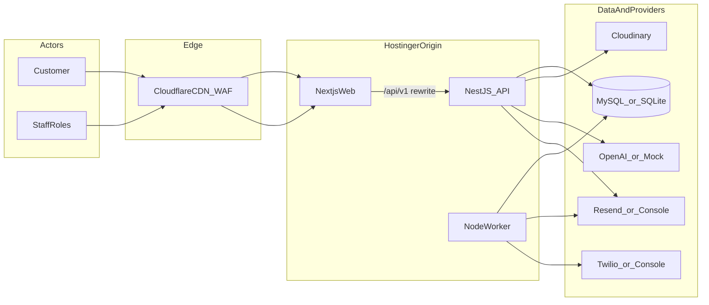
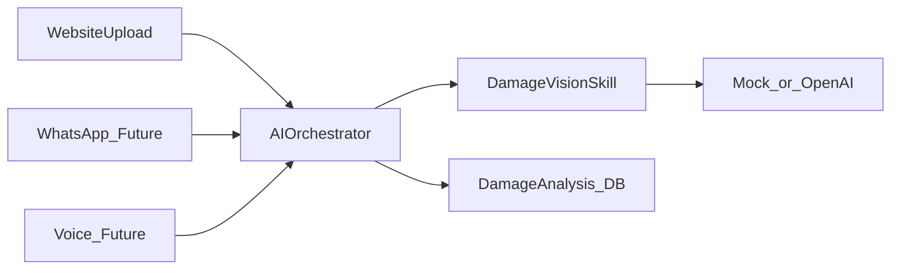

# Software Design Document (SDD)

**Project:** Cars Compound — Smart Customer Experience & Vehicle Management System  
**Document ID:** CC-SDD-001  
**Version:** 1.0  
**Date:** 2026-08-02  
**Audience:** Engineering, Product, DevOps, Stakeholders  

---

## 1. Purpose

This SDD defines the software architecture, module design, data design, interfaces, security, and deployment approach for the Cars Compound platform **before further production code changes**.

It ensures:
- Business logic remains separated from UI
- AI remains channel-agnostic
- Multi-branch / mobile / WhatsApp expansion does not require a rewrite
- Hosting constraints (Hostinger Node.js + Cloudflare) are respected

---

## 2. Scope

### In scope (v1)
- Public website journey (AI assess, book, track)
- Customer portal
- Staff / admin operations dashboard
- Repair stage machine + notifications
- Estimates & invoices
- Maintenance reminders + follow-up campaigns
- AI damage vision skill (advisory)
- Auth (email/password + tracking ID)
- Worker process for cron/outbox

### Out of scope (v1 — architecture reserved)
- Online payments
- Full insurance claims module
- Native mobile apps
- WhatsApp / Voice AI channels (ports only)
- Multi-organization SaaS billing
- Loyalty / fleet portals

---

## 3. System Context



---

## 4. Architectural Principles

| Principle | Implementation |
|-----------|----------------|
| Feature modules | NestJS modules: auth, customers, vehicles, repairs, ai, … |
| UI ≠ domain | Next.js is presentation; rules live in `@cc/domain` + API services |
| Ports & adapters | AI, storage, email, SMS behind interfaces in packages |
| Async side-effects | AI analysis + notifications never block critical UX longer than needed |
| Tenancy-ready | `organizationId` / `branchId` present from day one |
| Versioned API | All HTTP under `/api/v1` for future mobile clients |
| Idempotent messaging | `NotificationOutbox.idempotencyKey` unique |

---

## 5. Logical Architecture

```mermaid
flowchart TB
  subgraph presentation [Presentation]
    PublicUI[PublicPages]
    PortalUI[CustomerPortal]
    StaffUI[StaffDashboard]
  end

  subgraph application [Application_API]
    AuthM[AuthModule]
    RepairM[RepairsModule]
    AiM[AiModule]
    NotifyM[NotificationsModule]
    MaintM[MaintenanceModule]
    CampM[CampaignsModule]
  end

  subgraph domainPkg [DomainPackages]
    Domain[@cc/domain]
    AiCore[@cc/ai]
    NotifyCore[@cc/notifications]
  end

  subgraph infra [Infrastructure]
    Prisma[@cc/db_Prisma]
    Storage[StorageService]
    Cron[WorkerCron]
  end

  PublicUI --> AuthM
  PublicUI --> AiM
  PortalUI --> RepairM
  StaffUI --> RepairM
  RepairM --> Domain
  AiM --> AiCore
  NotifyM --> NotifyCore
  RepairM --> NotifyM
  MaintM --> NotifyM
  CampM --> NotifyM
  AuthM --> Prisma
  RepairM --> Prisma
  AiM --> Storage
  Cron --> NotifyM
  Cron --> MaintM
  Cron --> CampM
```

---

## 6. Module Design

| Module | Responsibility | Key invariants |
|--------|----------------|----------------|
| Auth | Login, register, JWT cookie, `/me` | Passwords hashed; tracking login rate-limited in production |
| Customers | Staff customer CRUD | Email unique |
| Vehicles | Garage / VIN / reg | Soft-delete via `deletedAt` |
| Appointments | Public book + staff list | Creates customer if missing |
| Repairs | Intake, stage machine, photos, public track | Stage transitions validated; insurance stage skippable |
| Estimates | Draft + finalize | Finalize only MANAGER/ADMIN/OWNER |
| Invoices | Issue + PDF payload | Unique invoice number |
| AI | Damage analysis orchestration | Advisory disclaimer persisted |
| Media | Local/Cloudinary delivery | Path traversal blocked for local files |
| Notifications | Outbox enqueue + process | Idempotent keys |
| Maintenance | Rules + due reminders | Interval months/years/km |
| Campaigns | Follow-up enrollment + step run | Marketing opt-in respected where required |
| Reports | Ops aggregates | Staff-only |

### Repair stage machine

Ordered stages (insurance optional):

`RECEIVED → INSPECTION_COMPLETED → [INSURANCE_APPROVAL] → PARTS_ORDERED → PARTS_RECEIVED → BODY_REPAIR → PAINTING → DRYING_FINISHING → ASSEMBLY → QUALITY_INSPECTION → ROAD_TEST → READY_FOR_PICKUP → DELIVERED`

Rules encoded in `@cc/domain` (`getEffectiveStages`, `progressPercent`, `canTransition`).

---

## 7. AI Design (channel-agnostic)



- Channels never call OpenAI directly.
- Skill returns structured JSON: findings, complexity, duration band, cost band, confidence, caveats.
- UI must always show disclaimer: final quote after physical inspection.

---

## 8. Non-Functional Requirements

| Category | Target |
|----------|--------|
| Availability | Single-origin Hostinger; Cloudflare edge for static |
| Performance | Portal lists paginated; AI async; CDN for images |
| Security | httpOnly JWT cookie, RBAC, Zod validation, upload MIME/size limits |
| Scalability | Vertical for v1; worker split; Redis queue later |
| Auditability | `AuditLog` for login, repair create, estimate finalize |
| Observability | Pino logs; optional Sentry; health endpoint |
| Compliance | Opt-in flags; media retention months configurable |

---

## 9. Roles & Authorization (summary)

| Role | Portal | Staff UI | Finalize estimate | Stage update | Intake |
|------|--------|----------|-------------------|--------------|--------|
| CUSTOMER | Yes | No | No | No | No |
| RECEPTION | No | Yes | No | Limited | Yes |
| TECHNICIAN | No | Yes | No | Yes | No |
| MANAGER | No | Yes | Yes | Yes | Yes |
| ADMIN/OWNER | No | Yes | Yes | Yes | Yes |

Full matrix: see [05 — Authentication Flow](./05-Authentication-Flow.md).

---

## 10. Cross-cutting Concerns

- **Validation:** Zod at controller/service boundary  
- **Config:** `@cc/config` env schema (fail fast)  
- **Logging:** Pino via `LoggerService`  
- **Files:** Cloudinary preferred; local fallback only for dev  
- **Jobs:** DB outbox + `node-cron` worker  

---

## 11. Risks & Mitigations

| Risk | Mitigation |
|------|------------|
| AI liability | Disclaimer + human finalize |
| Hostinger resource limits | Async jobs, CDN, query discipline |
| Notification storms | Idempotency keys + opt-out |
| SQLite vs MySQL drift | Document provider switch; prod = MySQL |
| Decorator DI with tsx | Nest CLI compile for API (`nest start`) |

---

## 12. Traceability

| Business feature | Design artifact |
|------------------|-----------------|
| AI damage analyzer | AI module + `@cc/ai` + DamageAnalysis ERD |
| Repair tracking | Repairs module + stage ERD + public track API |
| Customer portal | Web `/portal` + vehicles/repairs APIs |
| Staff dashboard | Web `/staff` + reports/repairs APIs |
| Maintenance automation | Maintenance module + worker |
| Follow-ups | Campaigns module + worker |

---

## 13. Approval Gate

Before modifying production code for new features:

1. Review this SDD set  
2. Confirm ERD changes (if any) in a migration plan  
3. Update API Spec for new endpoints  
4. Confirm auth/RBAC impact  
5. Confirm deploy impact (env, worker, Cloudflare)

---

## 14. Document Control

| Version | Date | Notes |
|---------|------|-------|
| 1.0 | 2026-08-02 | Initial SDD aligned to implemented monorepo baseline |
