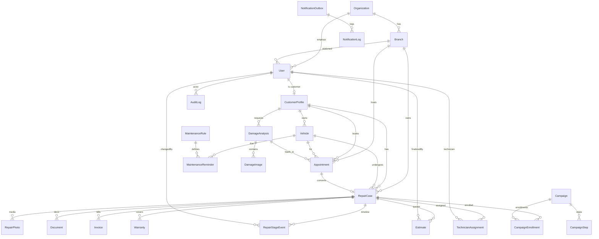
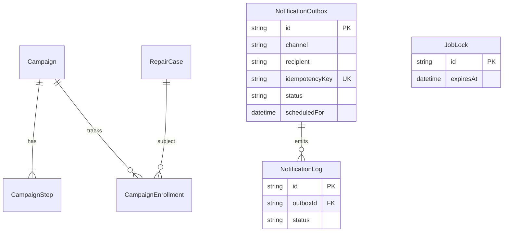

# Database ERD

**Document ID:** CC-SDD-002  
**ORM:** Prisma  
**Schema file:** `packages/db/prisma/schema.prisma`  
**Local provider:** SQLite  
**Production provider:** MySQL 8 (Hostinger)

---

## 1. Conceptual ERD (core domain)

---

## 2. Automation & messaging ERD

---

## 3. Entity catalog

### Identity & tenancy
| Entity | Purpose | Key fields |
|--------|---------|------------|
| Organization | Future multi-org | `slug` unique |
| Branch | Shop location | `(organizationId, code)` unique |
| User | Auth principal | `email` unique, `role`, opt-in flags |
| CustomerProfile | Customer aggregate | `userId` 1:1 |

### Vehicles & intake
| Entity | Purpose | Key fields |
|--------|---------|------------|
| Vehicle | Digital garage unit | `vin`, `registrationNumber`, `deletedAt` |
| Appointment | Inspection booking | `scheduledAt`, `status` |
| DamageAnalysis | AI run | `status`, `provider`, `resultJson`, `disclaimer` |
| DamageImage | AI inputs | `storageKey`, `url`, `mimeType` |

### Repair operations
| Entity | Purpose | Key fields |
|--------|---------|------------|
| RepairCase | Work order | `trackingId` unique, `currentStage`, `progressPercent`, `insuranceApplicable` |
| RepairStageEvent | Audit timeline | `fromStage`, `toStage`, `changedById` |
| RepairPhoto | Bay photos | `stage`, `url`, `deletedAt` |
| TechnicianAssignment | Tech mapping | `technicianId`, `active` |
| Estimate | Quote | `status`, money fields, `finalizedById` |
| Invoice | Billing doc | `number` unique, `status` |
| Warranty | Coverage | `startsAt`, `endsAt`, `active` |
| Document | Attachments | `title`, `url` |

### Retention automation
| Entity | Purpose | Key fields |
|--------|---------|------------|
| MaintenanceRule | Interval template | `code` unique, `intervalType`, `intervalValue` |
| MaintenanceReminder | Per-vehicle due | `dueAt`, `dueMileage`, `sentAt` |
| Campaign | Journey definition | `code`, `type`, `active` |
| CampaignStep | Offset message | `offsetDays`, `templateKey`, `bodyTemplate` |
| CampaignEnrollment | Per-repair journey | unique `(campaignId, repairCaseId)` |

### Platform
| Entity | Purpose | Key fields |
|--------|---------|------------|
| NotificationOutbox | Reliable send queue | `idempotencyKey` unique |
| NotificationLog | Attempt history | `outboxId`, `status` |
| AuditLog | Security/ops audit | `action`, `entityType`, `entityId` |
| JobLock | Worker lock stub | `expiresAt` |

---

## 4. Critical relationships & cardinality

| From | To | Cardinality | Notes |
|------|----|-------------|-------|
| User | CustomerProfile | 1:0..1 | Staff users may have no profile |
| CustomerProfile | Vehicle | 1:N | Multi-vehicle garage |
| Vehicle | RepairCase | 1:N | Permanent history |
| RepairCase | RepairStageEvent | 1:N | Append-only timeline |
| RepairCase | Estimate | 1:N | Multiple drafts possible |
| Appointment | RepairCase | 1:0..1 | Optional conversion |
| DamageAnalysis | Appointment | 1:N | Analysis can precede booking |

---

## 5. Indexes (performance)

Required / present indexes include:
- `User.email` (unique), `User.role`
- `RepairCase.trackingId` (unique), `customerId`, `vehicleId`, `currentStage`
- `NotificationOutbox (status, scheduledFor)`, `idempotencyKey` unique
- `MaintenanceReminder.dueAt`
- `Vehicle.vin`, `registrationNumber`
- `AuditLog (entityType, entityId)`, `createdAt`

---

## 6. Enums

| Enum | Values (abbrev.) |
|------|------------------|
| UserRole | OWNER, ADMIN, MANAGER, TECHNICIAN, RECEPTION, CUSTOMER |
| RepairStage | RECEIVED … DELIVERED (13 stages) |
| AppointmentStatus | REQUESTED, CONFIRMED, COMPLETED, CANCELLED, NO_SHOW |
| EstimateStatus | DRAFT, FINALIZED, REJECTED |
| InvoiceStatus | DRAFT, ISSUED, PAID, VOID |
| OutboxStatus | PENDING, PROCESSING, SENT, FAILED, CANCELLED |
| NotificationChannel | EMAIL, SMS, WHATSAPP |
| AnalysisStatus | PENDING, PROCESSING, COMPLETED, FAILED |
| CampaignType | FOLLOW_UP, SEASONAL, MAINTENANCE |

---

## 7. Future entities (reserved — do not require rewrite)

- Payment, Claim, Policy  
- LoyaltyAccount, FleetAccount  
- Conversation, VoiceCall  
- HealthScore, IntegrationWebhook  
- Expanded Org/Branch tenancy enforcement middleware  

---

## 8. Data lifecycle

| Data | Lifecycle |
|------|-----------|
| Damage / repair photos | Soft-delete → purge after `MEDIA_RETENTION_MONTHS` |
| RepairCase | Soft-delete via `deletedAt` |
| NotificationOutbox | Retain SENT for audit; archive later |
| AI `resultJson` | Persist with model/version for dispute support |

---

## 9. Environment note

- **Dev:** `DATABASE_URL=file:./dev.db` (SQLite)  
- **Prod:** MySQL URL; set Prisma `provider = "mysql"` and reintroduce native types (`@db.Text`, `@db.Decimal`) as needed before migrate
