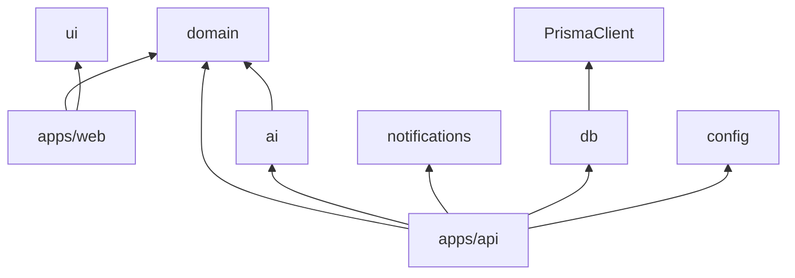

# Folder Structure

**Document ID:** CC-SDD-004  
**Layout style:** pnpm monorepo + Turborepo  
**Rationale:** Keep UI, API, domain, AI, and notifications as separate packages so mobile/WhatsApp/voice can reuse the same brain without rewriting the web app.

---

## 1. Root tree

```text
Operation Handler/
├── apps/
│   ├── api/                 # NestJS HTTP API + worker entry
│   └── web/                 # Next.js 15 App Router (public + portal + staff)
├── packages/
│   ├── ai/                  # Channel-agnostic AI orchestrator + vision skill
│   ├── config/              # Zod env schema
│   ├── db/                  # Prisma schema, client, seed
│   ├── domain/              # Pure business rules (stages, roles, tracking ID)
│   ├── notifications/       # Email/SMS ports + template renderer
│   └── ui/                  # Shared presentational primitives
├── docs/
│   ├── SDD/                 # This design pack
│   ├── PRODUCT_OVERVIEW_UR.md
│   ├── REQUIREMENTS.md
│   ├── STACK.md
│   └── DEPLOY.md
├── docker-compose.yml       # Optional MySQL for local prod-parity
├── package.json             # Workspace scripts
├── pnpm-workspace.yaml
├── turbo.json
├── .env.example
└── README.md
```

---

## 2. `apps/api` — backend

```text
apps/api/
├── nest-cli.json
├── package.json
├── tsconfig.json
└── src/
    ├── main.ts                 # HTTP bootstrap
    ├── worker.ts               # Cron: outbox / maintenance / campaigns
    ├── app.module.ts
    ├── health.controller.ts
    ├── core/
    │   ├── core.module.ts      # Global Prisma, Storage, Logger, ENV
    │   └── core.providers.ts
    └── modules/
        ├── auth/
        ├── customers/
        ├── vehicles/
        ├── appointments/
        ├── repairs/
        ├── estimates/
        ├── invoices/
        ├── ai/
        ├── media/
        ├── notifications/
        ├── maintenance/
        ├── campaigns/
        └── reports/
```

### Module boundary rules
1. Controllers: HTTP + Zod parse only  
2. Services: use-cases + Prisma transactions  
3. No React imports  
4. Cross-module notify/campaign via Nest module imports (`forwardRef` where needed)  
5. Domain math/rules imported from `@cc/domain`, not duplicated  

---

## 3. `apps/web` — frontend

```text
apps/web/
├── next.config.ts              # standalone + /api/v1 rewrite
├── package.json
├── postcss.config.mjs
└── src/
    ├── app/
    │   ├── layout.tsx
    │   ├── globals.css
    │   ├── page.tsx            # Landing
    │   ├── assess/page.tsx
    │   ├── book/page.tsx
    │   ├── track/page.tsx
    │   ├── login/page.tsx
    │   ├── portal/
    │   │   ├── page.tsx
    │   │   └── repairs/[id]/page.tsx
    │   └── staff/
    │       ├── page.tsx
    │       └── intake/page.tsx
    ├── components/
    │   └── site-header.tsx
    └── lib/
        └── api.ts              # fetch helper (cookie credentials)
```

### Frontend rules
- No repair stage business rules in React (import labels/order from `@cc/domain` only)
- Server/client components as needed; mutations via API
- Auth via cookie through same-origin rewrite

---

## 4. Shared packages

| Package | Import name | Contents |
|---------|-------------|----------|
| config | `@cc/config` | `loadEnv()`, typed env |
| domain | `@cc/domain` | `RepairStage`, progress, tracking ID, maintenance defaults, disclaimer |
| db | `@cc/db` | Prisma client export + schema/seed |
| ai | `@cc/ai` | `AIOrchestrator`, Mock/OpenAI providers |
| notifications | `@cc/notifications` | Dispatcher ports, `renderTemplate` |
| ui | `@cc/ui` | Optional shared controls |

```text
packages/db/
├── prisma/
│   ├── schema.prisma
│   ├── seed.ts
│   └── dev.db                 # local only (gitignored)
└── src/index.ts
```

---

## 5. Dependency direction (allowed)



**Forbidden:**
- `packages/*` importing `apps/*`
- `domain` importing Prisma or Nest
- `ai` importing HTTP/Express/Next

---

## 6. Why this structure

| Goal | How structure helps |
|------|---------------------|
| Avoid monolith mess | Feature modules under `apps/api/src/modules` |
| AI reusable everywhere | Isolated `@cc/ai` package |
| Mobile later | Same `/api/v1` + packages; new `apps/mobile` only |
| Swap SMS/email | `@cc/notifications` ports |
| Hostinger fit | API + worker entrypoints co-located in `apps/api` |

---

## 7. Suggested future folders (not created yet)

```text
apps/mobile/                   # React Native / Expo
packages/events/               # Domain events bus
packages/pdf/                  # Invoice PDF renderer
infra/terraform/               # optional IaC
```
