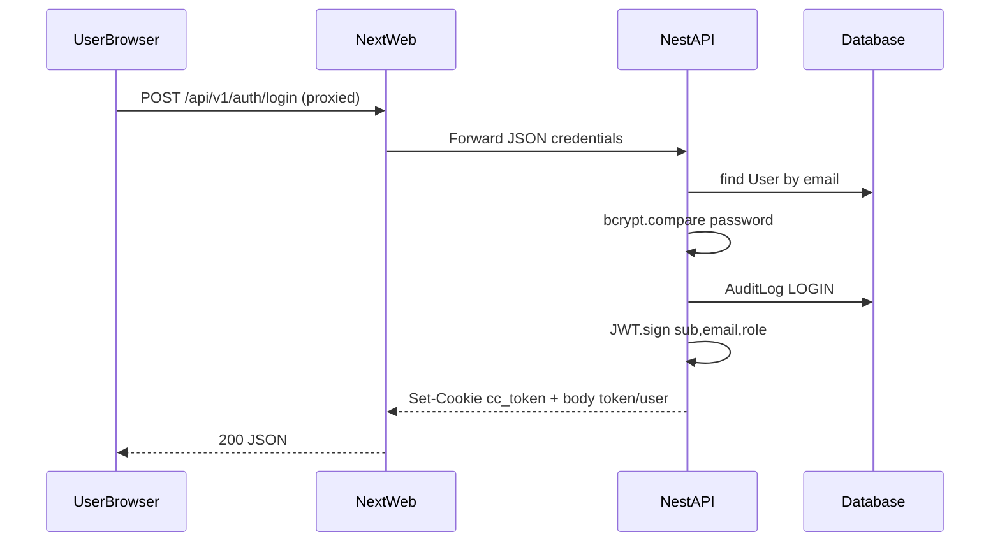
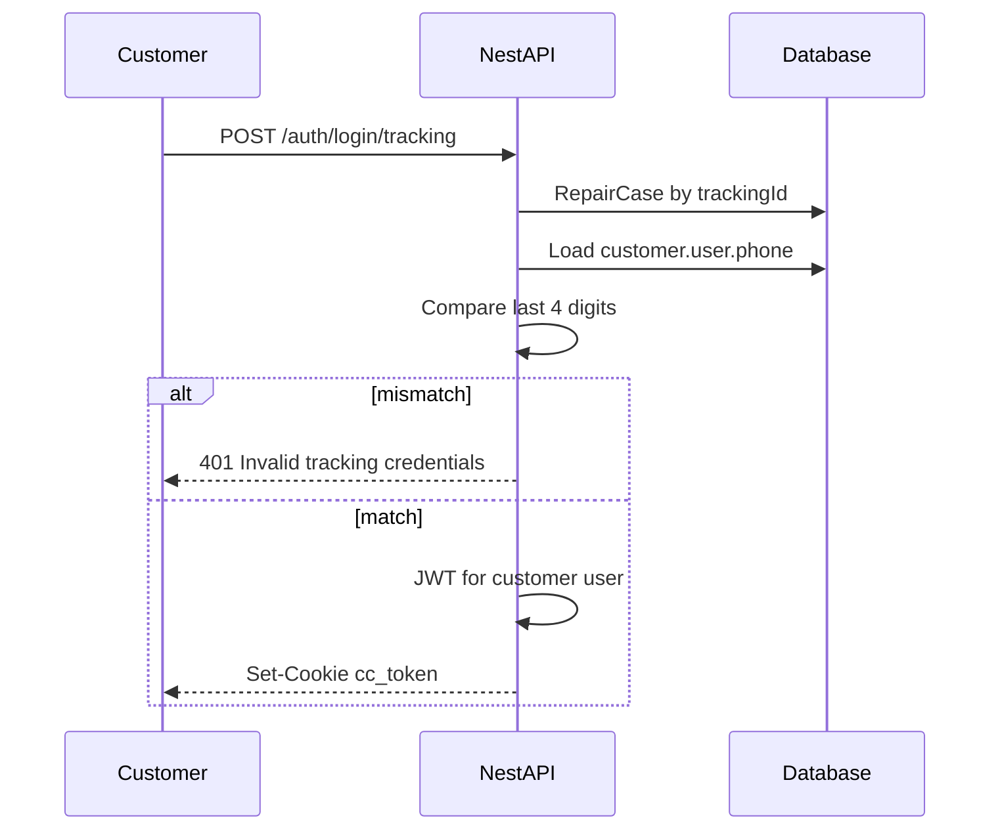
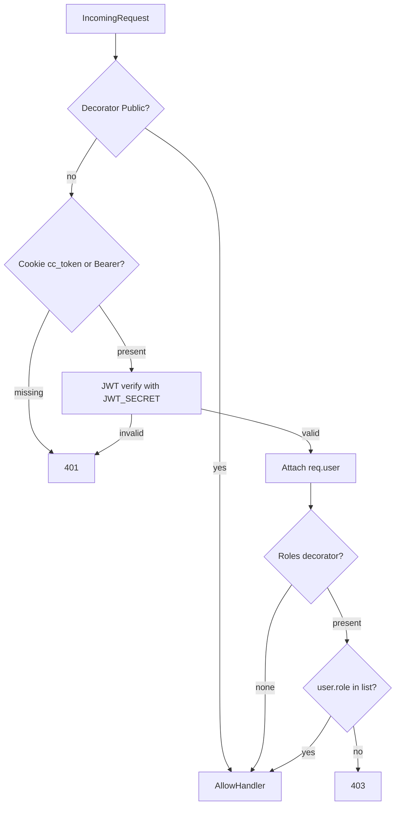

# Authentication & Authorization Flow

**Document ID:** CC-SDD-005  
**Mechanism:** JWT in httpOnly cookie `cc_token` (Bearer supported)  
**Password hashing:** bcrypt (cost 12)  
**Config:** `JWT_SECRET`, `JWT_EXPIRES_IN`, `COOKIE_SECURE`

---

## 1. Goals

1. Support **email + password** for portal and staff  
2. Support **Tracking ID + phone last-4** for low-friction customer access  
3. Enforce **RBAC** on staff mutations  
4. Keep tokens out of `localStorage` (XSS resistance via httpOnly cookie)  
5. Work with Next.js same-origin rewrite (cookie domain = web origin)

---

## 2. Roles

| Role | Type | Description |
|------|------|-------------|
| OWNER | Staff | Full control |
| ADMIN | Staff | Full operational control |
| MANAGER | Staff | Finalize estimates, manage ops |
| TECHNICIAN | Staff | Stage/photos/notes on repairs |
| RECEPTION | Staff | Intake, customers, appointments |
| CUSTOMER | External | Portal + public booking/assess |

---

## 3. Login flows

### 3.1 Email / password

### 3.2 Tracking ID + phone last-4

### 3.3 Customer self-register

`POST /auth/register` → create User(role=CUSTOMER) + CustomerProfile → JWT cookie.

---

## 4. Request authentication (global guard)

**Implementation notes:**
- Global `JwtAuthGuard` registered via `APP_GUARD`
- `@Public()` sets metadata `isPublic`
- `@Roles(...roles)` + `RolesGuard` on controllers/methods
- Reflector reads handler + class metadata

---

## 5. Cookie policy

| Attribute | Dev | Production |
|-----------|-----|------------|
| name | `cc_token` | `cc_token` |
| httpOnly | true | true |
| sameSite | lax | lax (or strict if single site) |
| secure | `COOKIE_SECURE=false` | `true` |
| maxAge | ~7d (`JWT_EXPIRES_IN`) | same |

**Cross-origin warning:** Browser on `:3000` calling API on `:4000` directly will not share cookies reliably. **Solution:** Next.js rewrite proxies `/api/v1` → API so cookie is first-party to the web origin.

---

## 6. Authorization matrix (operations)

| Operation | CUSTOMER | RECEPTION | TECH | MANAGER | ADMIN/OWNER |
|-----------|----------|-----------|------|---------|-------------|
| AI assess / book / public track | Public | Public | Public | Public | Public |
| View own portal repairs | Yes | — | — | — | — |
| List all customers | No | Yes | No* | Yes | Yes |
| Create intake / tracking ID | No | Yes | No | Yes | Yes |
| Change repair stage | No | Yes | Yes | Yes | Yes |
| Upload repair photos | No | Yes | Yes | Yes | Yes |
| Create estimate | No | Yes | No | Yes | Yes |
| Finalize estimate | No | No | No | Yes | Yes |
| Create invoice | No | No | No | Yes | Yes |
| Ops reports | No | No | No | Yes | Yes |
| Cron process endpoints | Header secret | Header secret | — | — | — |

\* Technician may `GET /customers/:id` for context; not list/create in current matrix for list endpoint (list excludes TECH — see API spec).

---

## 7. Resource scoping rules

| Resource | CUSTOMER scope |
|----------|----------------|
| Vehicles | Only `customerProfile.id` match |
| Repairs | Only own `customerId` |
| Invoices | Via repair ownership (API currently role-gated; enforce ownership in hardening) |

Staff roles see shop-wide data (single branch v1).

---

## 8. Secrets & session threats

| Threat | Control |
|--------|---------|
| XSS token theft | httpOnly cookie |
| CSRF | SameSite=lax + same-origin API proxy; add CSRF token if cookie used cross-site later |
| Brute force login | Rate limit (production hardening required on login/tracking/AI) |
| Tracking ID guessing | High-entropy ID alphabet + phone last-4 + rate limit |
| Privilege escalation | Server-side role checks every mutation |
| Secret leakage | Env-only `JWT_SECRET` / `CRON_SECRET`; never commit `.env` |

---

## 9. Cron / machine auth

Endpoints:
- `POST /notifications/process`
- `POST /maintenance/run-reminders`
- `POST /campaigns/run`

Auth: header `x-cron-secret` must equal `CRON_SECRET`.  
Not a user JWT. Worker may call services in-process without HTTP.

---

## 10. Logout

`POST /auth/logout` clears cookie. JWT remains valid until expiry if stolen from memory — keep TTLs short in high-security modes; optional denylist later.

---

## 11. Future auth extensions (no rewrite)

- Staff MFA (TOTP)  
- Magic-link email login  
- OAuth (Google) for customers  
- Per-branch claims in JWT (`branchId`)  
- Refresh token rotation  
- WhatsApp identity linking to CustomerProfile  
