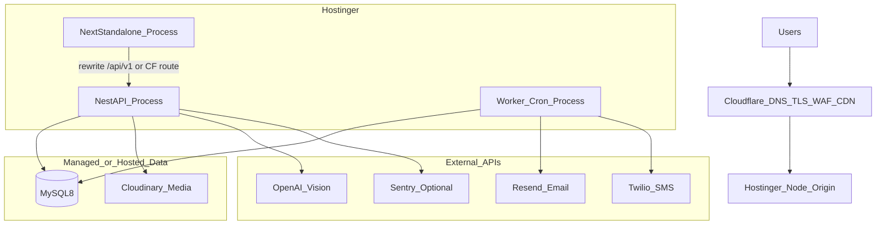
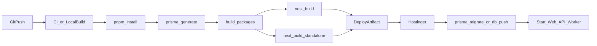
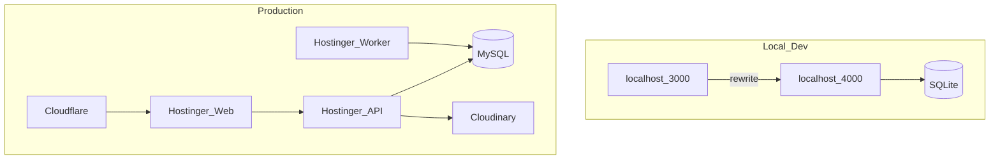

# Deployment Architecture

**Document ID:** CC-SDD-006  
**Primary target:** Hostinger Node.js Hosting + Cloudflare  
**Rejected as primary compute for v1:** Vercel Free (Hobby) — AI timeouts, weak cron/background jobs  

---

## 1. Target topology



---

## 2. Processes

| Process | Entry | Port | Responsibility |
|---------|-------|------|----------------|
| Web | `node apps/web/.next/standalone/server.js` | 3000 (or Hostinger assigned) | SSR/UI |
| API | `node apps/api/dist/main.js` | `PORT` (e.g. 4000) | REST `/api/v1` |
| Worker | `node apps/api/dist/worker.js` | none | Outbox every 1m; maintenance hourly; campaigns */30m |

**Constraint:** Shared Hostinger Node plans may allow one primary process — prefer VPS or run worker via system cron hitting secured HTTP endpoints if multi-process is unavailable.

### Cron fallback (single process)
If worker cannot run continuously:
- System cron → `curl -X POST -H "x-cron-secret: …" https://api…/notifications/process`
- Same for `/maintenance/run-reminders` and `/campaigns/run`

---

## 3. Build pipeline



Commands (reference):
```bash
pnpm install --frozen-lockfile
pnpm db:generate
pnpm build
# production DB:
pnpm exec prisma migrate deploy  # or db push with care
pnpm db:seed                     # first deploy only
```

---

## 4. Networking & Cloudflare

| Rule | Setting |
|------|---------|
| DNS | Proxied orange-cloud to Hostinger |
| SSL | Full (strict) |
| Cache | Cache static `_next/static`, images; **bypass** `/api/*`, `/portal`, `/staff`, `/login`, `/assess` |
| WAF | Managed rules on |
| Rate limit | Login, AI upload, tracking endpoints at edge if available |

**API exposure options:**
1. **Preferred:** Web origin serves UI; `/api/v1` rewritten/proxied to API process (hides API port)  
2. **Alt:** `api.domain.com` → API; configure CORS + cookie `Domain` carefully  

---

## 5. Environment matrix

| Variable | Dev | Prod |
|----------|-----|------|
| `NODE_ENV` | development | production |
| `DATABASE_URL` | SQLite file | MySQL connection string |
| `COOKIE_SECURE` | false | true |
| `STORAGE_LOCAL_FALLBACK` | true | false |
| `AI_PROVIDER` | mock | openai |
| `EMAIL_PROVIDER` | console | resend |
| `SMS_PROVIDER` | console | twilio |
| `JWT_SECRET` | long random | unique strong secret |
| `CRON_SECRET` | shared local | unique strong secret |

Full list: `.env.example` + `@cc/config` schema.

---

## 6. Data & media

| Concern | Dev | Prod |
|---------|-----|------|
| DB | SQLite `packages/db/dev.db` | Hostinger MySQL 8 |
| Media | `uploads/` local | Cloudinary signed/authenticated upload |
| Backups | optional | Daily MySQL dump + restore drill |
| Retention | soft-delete | purge job by `MEDIA_RETENTION_MONTHS` |

---

## 7. Local vs production diagram



---

## 8. Why not Vercel Free as primary

| Requirement | Vercel Hobby issue | Hostinger approach |
|-------------|--------------------|--------------------|
| Multi-image AI | ~10s function timeout | Long-running API + async job |
| Cron campaigns | Limited / external paid jobs | `node-cron` worker or system cron |
| Outbox processor | Needs Inngest/QStash | In-process worker |
| Cost predictability | Many add-ons | Fixed hosting + usage APIs |

Optional later: marketing static pages on Vercel; **core API/worker stay on Hostinger**.

---

## 9. Health, monitoring, rollback

| Item | Approach |
|------|----------|
| Liveness | `GET /api/v1/health` |
| Errors | Sentry DSN optional |
| Uptime | UptimeRobot on web + health |
| Rollback | Keep previous `dist` artifact; reverse symlink/release folder |
| DB rollback | Forward-only migrations preferred; restore from backup if destructive |

---

## 10. Security checklist (deploy gate)

- [ ] `.env` not in git  
- [ ] `COOKIE_SECURE=true`  
- [ ] Cloudinary required (no public open upload dir)  
- [ ] Strong `JWT_SECRET` / `CRON_SECRET`  
- [ ] Cloudflare WAF on  
- [ ] Admin seed password rotated  
- [ ] MySQL least-privilege user  
- [ ] HTTPS only  

---

## 11. Capacity assumptions (v1)

- Single branch  
- Hundreds–low thousands of customers  
- ~200 AI analyses / month  
- ~2,000 SMS / month (if enabled)  
- Vertical scale sufficient; split worker first under load  

---

## 12. References

- Operational steps: [../DEPLOY.md](../DEPLOY.md)  
- Stack lock: [../STACK.md](../STACK.md)  
- API contracts: [./03-API-Specification.md](./03-API-Specification.md)  
